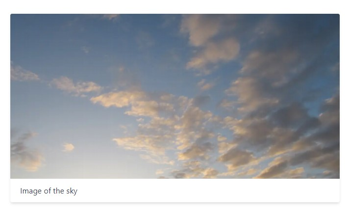
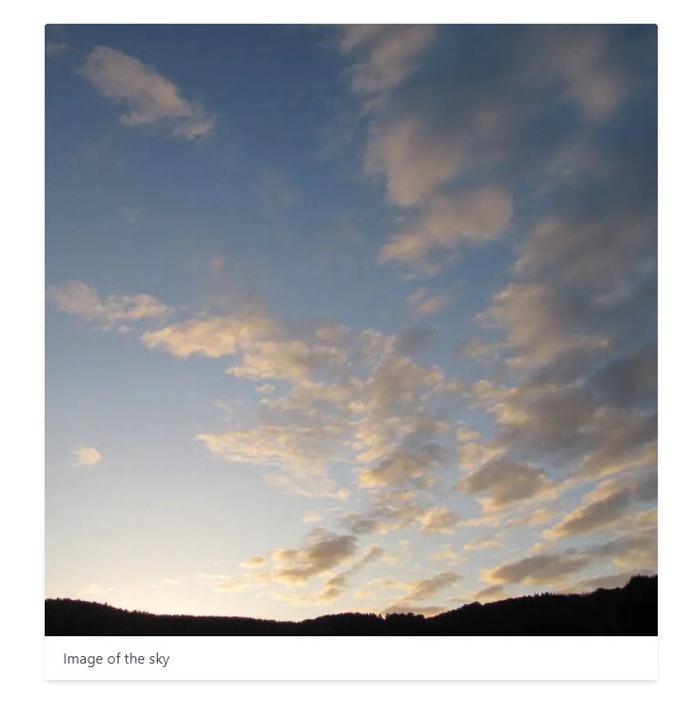

# next-native-image

Just make use of the optimization when you already take care of Cumulative Layout Shift yourself.

Modified next/image to add the option "native" to layout which creates a plain img tag without wrappers or styles.

## Installation

```sh
yarn add next-native-image
```

or

```sh
npm i next-native-image
```

## Usage

Example with [tailwindcss](https://tailwindcss.com) and [tailwindcss-aspect-ratio](https://github.com/tailwindlabs/tailwindcss-aspect-ratio):

```javascript
// components/ImageCard.tsx
import Image from "next-native-image";

export default function ImageCard() {
  return (
    <div className="bg-white shadow-md max-w-2xl mx-auto rounded overflow-hidden">
      <div className="overflow-hidden">
        <div className="aspect-w-2 aspect-h-1 bg-gray-500">
          <Image
            src="/images/sky.jpg"
            width={1000}
            layout="native"
            className="object-cover w-full h-full"
          />
        </div>
      </div>
      <div className="px-5 py-3">
        <div className="text-gray-700">Image of the sky</div>
      </div>
    </div>
  );
}
```

```javascript
// index.tsx
import ImageCard from "../components/ImageCard";

export default function Home() {
  return (
    <div className="mt-12">
      <ImageCard />
    </div>
  );
}
```

Build result:

```html
<div id="__next">
  <div class="mt-12">
    <div class="bg-white shadow-md max-w-2xl mx-auto rounded overflow-hidden">
      <div class="overflow-hidden">
        <div class="aspect-w-2 aspect-h-1 bg-gray-500">
          
        </div>
      </div>
      <div class="px-5 py-3">
        <div class="text-gray-700">Image of the sky</div>
      </div>
    </div>
  </div>
</div>
```

sky.jpg: <a href="https://commons.wikimedia.org/wiki/File:Cloudy_sky_in_the_morning.jpg">Defchris</a>, <a href="https://creativecommons.org/licenses/by-sa/3.0">CC BY-SA 3.0</a>, via Wikimedia Commons

Result:



Result with 1x1 aspect ratio:


